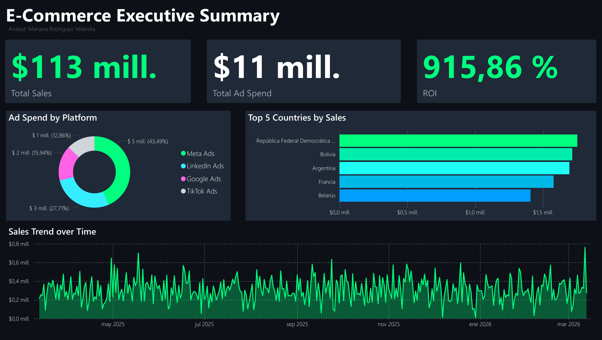

# Pipeline de Datos E-commerce y Analisis Ejecutivo (Proyecto 2026)

*[Read English version](README.md)*

Este proyecto presenta un ecosistema integral de análisis de datos de principio a fin (End-to-End). Cubre desde la extracción y limpieza de datos transaccionales crudos (creados con el fin de este proyecto) mediante procesos **ETL en Python**, hasta la creación de un **Dashboard Ejecutivo** en Power BI (con un diseño Dark Mode o FinTech) orientado a la toma de decisiones directivas.

## Impacto de Negocio y KPIs
El análisis de la base de datos de e-commerce reveló las siguientes métricas clave de rendimiento:
* **Total sales:** $113 Millones USD generados.
* **Return on Investment (abrevaido ROI):** Alcanzó un **915.86%**, demostrando una eficiencia extraordinaria en el presupuesto de pauta digital ($11 Mill. Ad Spend). En este caso un ROI de 9,16 quiere decir que por cada $1 dolar que la empresa gastó en publicidad, ganaron $9.16 dolares.
* **Top market:** La República Federal Democrática de Nepal lidera las ventas globales, seguida de cerca por Bolivia y Argentina.

## Vista Previa del Dashboard
*(Visualización interactiva desarrollada en Power BI)*

## Arquitectura Técnica y Proceso ETL
El proyecto está estructurado para asegurar la reproducibilidad y el modelado limpio de los datos:
* **`scripts/`**: Contiene los scripts de Python (`etl_process.py`, `generate_data.py`) responsables de la generación de datos, manejo de valores nulos, estandarización de fechas/monedas, y exportación de las tablas limpias.
* **`data/raw/`**: Fuentes de datos originales (Bases de datos SQLite y archivos Excel).
* **`data/processed/`**: Archivos CSV limpios y transformados, listos para el modelado.
* **`dashboards/`**: Archivo fuente del reporte en Power BI (`.pbix`).

> **[Haz click en este link para leer el Resumen Ejecutivo y Recomendaciones estrateggicas](RESUMEN_EJECUTIVO.md)**

---
**Ingenieria de Datos y Visualización por Mariana Rodriguez Velandia**